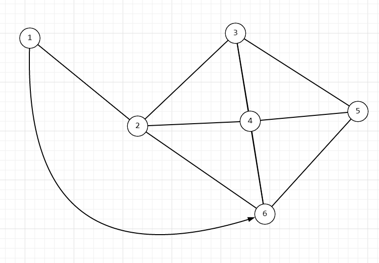
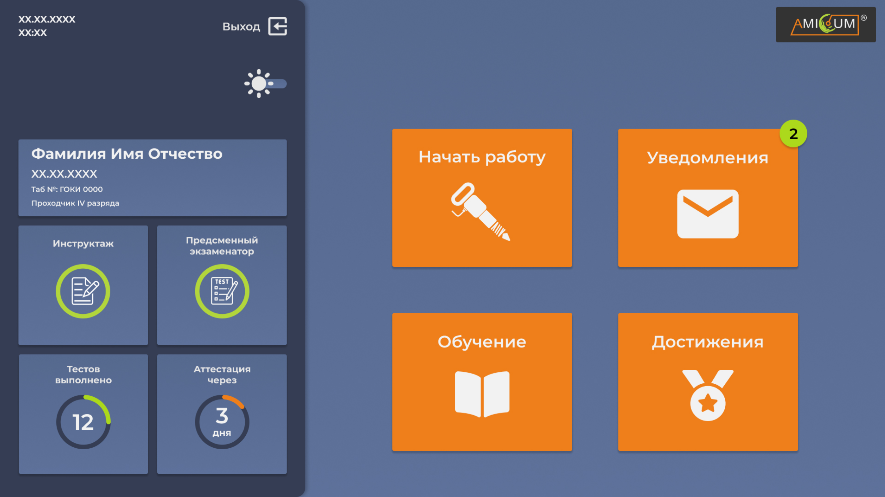

# Тестовое задание для компании ООО "Профсоюз"

## Backend



Создать граф вывести в Лог (log)  (текстовый файл).

**Задача:** из вершины 1 найти кратчайший путь к вершине 6.

### Реализация

Реализация задачи представлена в скрипте [back.php](./back.php). Для проверки его работы нужно запустить контейнер php, используя следующую команду: ``` docker run --rm -i -v ./back.php:/app/script.php -w /app  php:7.4-cli-alpine php script.php ```

## Frontend

Необходимо реализовать вёрстку следующего макета:

с использованием VueJS v2.

### Реализация

Вёрстка (html, css и картинки) можно посмотреть в каталоге [front](./front). Для интерактивного просмотра нужно запустить docker compose из каталога front при помощи команды ``` docker compose up -d ```. Далее зайти в контейнер NodeJs и выполнить команды:
```
npm i
npm run build
```
Первая - устанавливает нужные пакеты NodeJs. Вторая - компилирует стили из scss в css

После этих действий можно зайти браузером по адресу [localhost:8077](http://localhost:8077), который будет доступен сразу же после успешного запуска связки контейнеров

